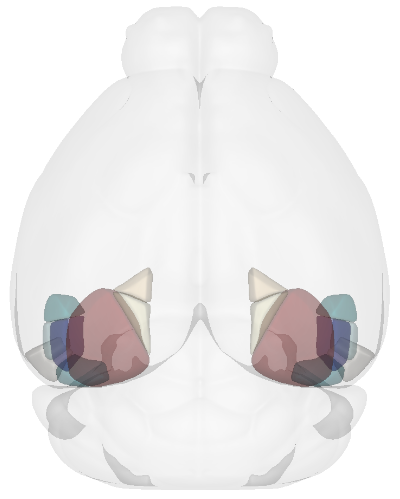
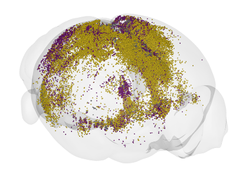
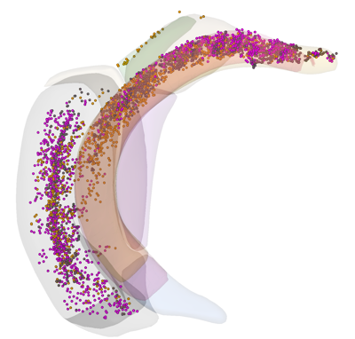
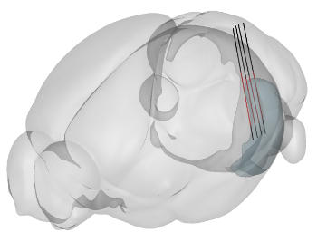

BrainRender
=======================

This module provides a CLI-based wrapper for `brainrender <https://brainglobe.info/documentation/brainrender/index.html>`_.
Once installed, the CLI can be invoked directly from the command line.

- **See Options**

.. code-block:: bash

    $ neuralib_brainrender -h

- **Output**

.. code-block:: text

    BrainRender CLI Options

    options:
      -h, --help        show this help message and exit

    commands:
      {area,roi,probe}
        area            Reconstruct a 3D brain view used brainrender module
        roi             ROIs reconstruction with brainrender
        probe           Probe track reconstruction with brainrender

Region Reconstruction
---------------------------------

- **Refer to API**: :doc:`../api/neuralib.atlas.brainrender.core`

- **See Options**

.. code-block:: bash

    $ neuralib_brainrender area -h

- **Output**

.. code-block:: text

    Basic Settings Option:
      --camera sagittal|sagittal2|frontal|top|top_side|three_quarters
                            camera angle
      --style metallic|cartoon|plastic|shiny|glossy
                            Shader style to use
      --title TEXT          title added to the top of the window
      -S NAME, --source NAME
                            atlas source name. allen_human_500um as human
      --root-alpha ROOT_ALPHA
                            root alpha
      --no-root             render without root(brain) mesh
      --bg white|black      background color
      --coord-space ccf|brainrender
                            which coordinate space, by default ccf

    Optional Option:
      --annotation AV,DV,ML
                            whether draw point annotation. e.g., 1.5:1:0.4,-3.2:0.8:0.4 for two points

    Region Option:
      -R NAME,..., --region NAME,...
                            region(s) name
      --region-color COLOR,...
                            region(s) color
      --region-alpha REGIONS_ALPHA
                            region alpha value
      -H right|left|both, --hemisphere right|left|both
                            which hemisphere for rendering the region
      --print-tree          print tree for the available regions for the given source
      --tree-init TREE_INIT
                            init region for the tree print
      --print-name          print acronym and the corresponding name

    Output Option:
      --video-output VIDEO_OUTPUT
                            video output path
      -O OUTPUT, --output OUTPUT
                            output path for the html, if None, preview

- **Example of Reconstructing the Visual Cortex subregions**

.. code-block:: bash

    $ neuralib_brainrender area -R VISal,VISam,VISl,VISli,VISp,VISpl,VISpm,VISpor --camera top

|brender area|

ROI Reconstruction
---------------------------------

Reconstruct ROIs together with brain region(s)

- **Refer to API**: :doc:`../api/neuralib.atlas.brainrender.roi`

- **See Options**

.. code-block:: bash

    $ neuralib_brainrender roi -h

- **Output**

.. code-block:: text

    ROI View Option:
      --roi-region NAME,...
                            only show rois in region(s)
      --roi-radius RADIUS   each roi radius
      --roi-alpha ROI_ALPHA
                            region alpha value
      --roi-colors COLOR,...
                            colors of rois per region
      --region-col TREE..   if None, auto infer, and check the lowest merge level contain all the regions specified
      --inverse-lut         inverse right/left maps to ipsi/contra hemisphere look up table
      --source-order SOURCE,...
                            source order to follow the roi_colors

.. note::

    By default, coordinates are interpreted in the CCF coordinate space.
    You can specify the coordinate space using the ``--coord-space`` option: ``{ccf, brainrender}``.

**NumPy File Input**
^^^^^^^^^^^^^^^^^^^^^^^^^^^^^^^^^^^^^^^^

Input shape: ``Array[float, (N, 3)]``, with AP, DV, and ML coordinates.

- **Example**

.. code-block:: python

    [[-3.03,  4.34, -4.50],
     [-3.03,  4.42, -4.37],
     ...
     [-2.91,  4.12,  4.85]]

- **Run**

.. code-block:: bash

    $ neuralib_brainrender roi --file <NUMPY_FILE>

**CSV File Input**
^^^^^^^^^^^^^^^^^^^^^^^^^^^^^^^^^^^^

- Required columns: ``AP_location``, ``DV_location``, ``ML_location``

.. code-block:: text

    ┌─────────────┬─────────────┬─────────────┐
    │ AP_location │ DV_location │ ML_location │
    │------------ │-------------│-------------│
    │ -3.03       │ 4.34        │ -4.50       │
    │ -3.03       │ 4.92        │ -4.31       │
    │ ...         │ ...         │ ...         │
    │ -2.91       │ 4.12        │ 4.85        │
    └─────────────┴─────────────┴─────────────┘

- **Example**

.. code-block:: bash

    $ neuralib_brainrender roi --file <CSV_FILE>

|brender roi|

**Flexible Reconstruction (Processed CSV)**
^^^^^^^^^^^^^^^^^^^^^^^^^^^^^^^^^^^^^^^^^^^

Be able to reconstruct rois in a specific regions/subregions

- **Example of using parsed allenccf csv output**

.. code-block:: text

    ┌───────────────────────────────────┬─────────┬─────────────┬─────────────┬─────────────┬─────────┬─────────┬────────┬────────────┐
    │ name                              ┆ acronym ┆ AP_location ┆ DV_location ┆ ML_location ┆ avIndex ┆ channel ┆ source ┆  ...       │
    │ ---                               ┆ ---     ┆ ---         ┆ ---         ┆ ---         ┆ ---     ┆ ---     ┆ ---    ┆  ---       │
    │ str                               ┆ str     ┆ f64         ┆ f64         ┆ f64         ┆ i64     ┆ str     ┆ str    ┆  ...       │
    ╞═══════════════════════════════════╪═════════╪═════════════╪═════════════╪═════════════╪═════════╪═════════╪════════╪════════════╡
    │ Ectorhinal area/Layer 5           ┆ ECT5    ┆ -3.03       ┆ 4.34        ┆ -4.5        ┆ 377     ┆ gfp     ┆ VIS    ┆  ...       │
    │ Perirhinal area layer 6a          ┆ PERI6a  ┆ -3.03       ┆ 4.42        ┆ -4.37       ┆ 372     ┆ gfp     ┆ VIS    ┆  ...       │
    │ …                                 ┆ …       ┆ …           ┆ …           ┆ …           ┆ …       ┆ …       ┆ …      ┆  …         │
    │ Ventral auditory area layer 6a    ┆ AUDv6a  ┆ -2.91       ┆ 3.52        ┆ 4.46        ┆ 156     ┆ rfp     ┆ CA1    ┆  ...       │
    │ Ectorhinal area/Layer 6a          ┆ ECT6a   ┆ -2.91       ┆ 4.14        ┆ 4.47        ┆ 378     ┆ rfp     ┆ CA1    ┆  ...       │
    │ Temporal association areas layer… ┆ TEa5    ┆ -2.91       ┆ 4.02        ┆ 4.55        ┆ 365     ┆ rfp     ┆ CA1    ┆  ...       │
    └───────────────────────────────────┴─────────┴─────────────┴─────────────┴─────────────┴─────────┴─────────┴────────┴────────────┘

.. code-block:: python

    import polars as pl
    from neuralib.atlas.ccf.classifier import RoiClassifierDataFrame

    df = pl.DataFrame({
        "acronym": ["RSPd", "RSPd", "VISp", "VISp"],
        "AP_location": [1.2, 1.3, -2.4, -2.6],
        "DV_location": [1.0, 1.1, 2.0, 2.1],
        "ML_location": [0.4, -0.3, 0.2, -0.2],
        "channel": ["gfp", "gfp", "rfp", "rfp"],
        "source": ["CA1", "CA1", "CA3", "CA3"]
    })

    df = RoiClassifierDataFrame(df).post_processing().dataframe()
    df.write_csv(CSV_FILE)

.. seealso::

    :class:`~neuralib.atlas.ccf.dataframe.RoiClassifierDataFrame`

- **Example (reconstruct ROI in the parahippocampal areas)**

.. code-block:: bash

    $ neuralib_brainrender roi --classifier-file <CSV_FILE> --region APr,ENT,HATA,PAR,POST,PRE,ProS,SUB --roi-region RHP --region-alpha 0.2 --roi-radius 20 --no-root -H right

|brender roi_region|

Probe Reconstruction
----------------------------------------

Reconstruct probes (or shanks) based on trajectory labeling (e.g., DiI, DiO, or lesion tracks)

- **Refer to API**: :doc:`../api/neuralib.atlas.brainrender.probe`

- **See Options**

.. code-block:: bash

    $ neuralib_brainrender probe -h

- **Output**

.. code-block:: text

    Probe Option:
      --depth IMPLANT_DEPTH
                            implant depth in um
      --interval SHANK_INTERVAL
                            shank interval in um if multi-shank
      --dye                 only show the histology dye parts
      --remove-outside-brain
                            remove reconstruction outside the brain
      --file FILE           multi-shank npy or csv file to be inferred
      --plane-type coronal|sagittal|transverse, -P coronal|sagittal|transverse
                            cutting orientation to infer the multi-shank label point/probe_idx

- Default coordinate space: CCF
- Set coordinate space using: ``--coord-space {ccf, brainrender}``
- Each shank must have 2 points: dorsal and ventral

**NumPy File Input**
^^^^^^^^^^^^^^^^^^^^

- **Single shank: ``Array[float, (2, 3)]`` (dorsal and ventral 3D AP/ML/DV coordinates)**

.. code-block:: python

    [[-3.82, 1.92, -3.12],
     [-3.93, 4.36, -3.30]]

- **Multi-shank: ``Array[float, (S, 2, 3)]``**

.. code-block:: python

    [[[...], [...]],
     [[...], [...]],
     ...]

**CSV File Input**
^^^^^^^^^^^^^^^^^^

- Required fields: ``AP_location``, ``DV_location``, ``ML_location``, ``point``, ``probe_idx``

- If loss either ``point``, ``probe_idx`` field, then auto infer based on the given insertion ``--plane``

.. code-block:: text

    ┌─────────────┬─────────────┬─────────────┬─────────┬───────────┐
    │ AP_location │ DV_location │ ML_location │ point   │ probe_idx │
    ├─────────────┼─────────────┼─────────────┼─────────┼───────────┤
    │ -3.81       │ 1.92        │ -3.12       │ dorsal  │ 1         │
    │ -3.93       │ 4.36        │ -3.30       │ ventral │ 1         │
    │ ...         │ ...         │ ...         │ ...     │ ...       │
    └─────────────┴─────────────┴─────────────┴─────────┴───────────┘

**Additional Probe Options**
^^^^^^^^^^^^^^^^^^^^^^^^^^^^^^^^^^^^^^^^^^^^

- ``--depth DEPTH``: Depth (in µm) of the implantation from the brain surface
- ``--dye``: Only reconstruct dye-labeled tracks (default includes both dye and theoretical)
- ``--remove-outside-brain``: Exclude any segments outside the brain

- **Example of Reconstructing a 4-shank NeuroPixel probe targeting the left entorhinal cortex**

.. code-block:: bash

    $ neuralib_brainrender probe -F <FILE> --depth 3000 -P sagittal -R ENT -H left

- Red = dye-labeled track
- Black = theoretical track

|brender probe|

