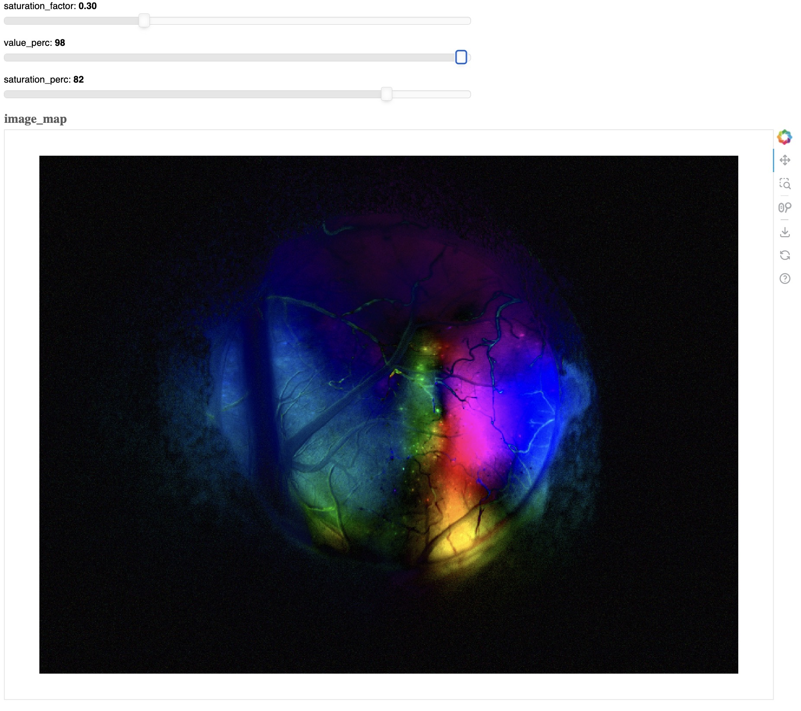
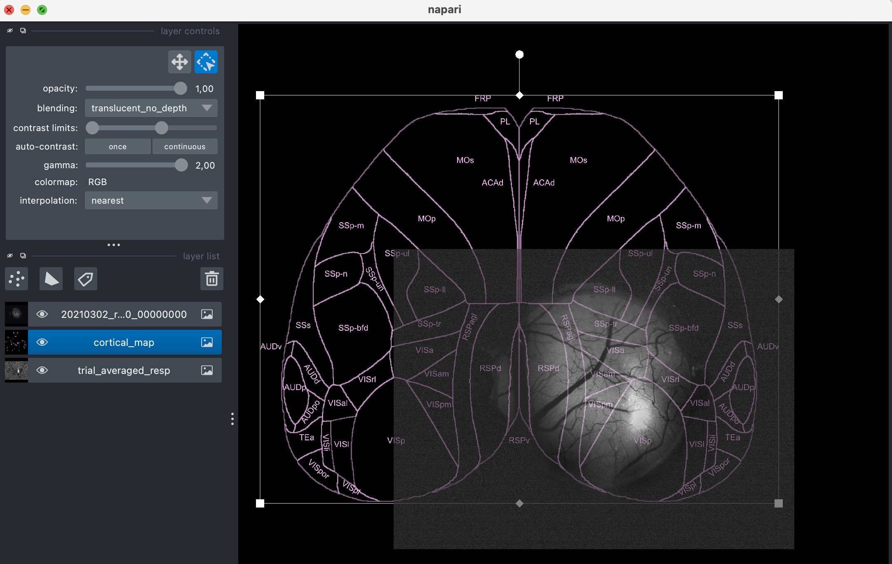

WideField
=========

This module provides tools for processing widefield video sequence data and is currently under active development.

FFT View with Bokeh
---------------------

A Bokeh-based visualization of the HSV colormap representation of the Fourier-transformed video (e.g., for visual retinotopy).

Usage:

.. code-block:: python

    neuralib_widefield fft <FILE>

|fft_view|

Align with Napari
--------------------------

A Napari-based tool for aligning video data to a dorsal cortex view.

Usage:

.. code-block:: python

    neuralib_widefield align <FILE> [-R REFERENCE_FILE] [-M MAP_FILE]

|align_view|

